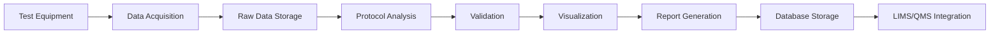

# PV Testing Protocol Framework

**Modular, Scalable, Production-Ready Framework for Photovoltaic Module Testing**

[](https://www.python.org/downloads/)
[](https://opensource.org/licenses/MIT)
[](https://github.com/psf/black)

---

## 📋 Overview

A comprehensive, production-ready framework implementing **54 standardized PV testing protocols** following IEC, ASTM, and UL standards. Features JSON-based dynamic templates for Streamlit/GenSpark UI with automated analysis, interactive charting, quality control, and multi-format report generation. Fully integrated with LIMS, QMS, and Project Management systems.

### 🎯 Key Features

✅ **54 Complete Protocol Implementations** - Performance, Degradation, Environmental, Mechanical, Safety
✅ **Modular Architecture** - Each protocol is independent and plug-and-play
✅ **Interactive UI Support** - Conditional fields, smart dropdowns, auto-validation
✅ **Real-Time Visualizations** - Plotly-based interactive charts and graphs
✅ **Complete Data Traceability** - Full audit trail from raw data to final report
✅ **Multi-Format Reports** - PDF, Excel, JSON, HTML export
✅ **Database Integration** - PostgreSQL with full ORM support
✅ **Comprehensive Testing** - Unit tests for all protocols
✅ **Standards Compliant** - IEC 61215, IEC 61730, IEC 62804, ASTM, UL 1703

---

## 🏗️ Architecture

```
test-protocols/
├── protocols/              # Protocol implementations (54 protocols)
│   ├── base_protocol.py   # Abstract base class
│   ├── performance/       # 12 performance protocols
│   ├── degradation/       # 15 degradation protocols
│   ├── environmental/     # 12 environmental protocols
│   ├── mechanical/        # 8 mechanical protocols
│   └── safety/            # 7 safety protocols
├── templates/             # JSON templates for each protocol
│   └── protocols/         # 54 JSON configuration files
├── utils/                 # Shared utilities
│   ├── data_validation.py # Validation framework
│   ├── visualization.py   # Plotly chart builders
│   ├── calculations.py    # PV calculations & statistics
│   └── report_generator.py # Report generation
├── database/              # Database layer
│   ├── schema.sql         # PostgreSQL schema
│   ├── models.py          # SQLAlchemy ORM models
│   └── migrations/        # Alembic migrations
├── tests/                 # Comprehensive test suite
│   ├── unit/              # Unit tests
│   └── integration/       # Integration tests
├── config/                # Configuration files
│   └── config.yaml        # Application configuration
├── docs/                  # Documentation
│   ├── protocols/         # Protocol-specific docs
│   └── api/               # API documentation
└── generate_protocols.py  # Protocol generator script
```

---

## 📦 Complete Protocol List

### 🔋 Performance Protocols (12)

| Protocol ID | Name | Standard | Description |
|------------|------|----------|-------------|
| **STC-001** | Standard Test Conditions | IEC 61215-1 MQT 01 | Performance at STC (1000 W/m², 25°C, AM1.5) |
| **NOCT-001** | Nominal Operating Cell Temp | IEC 61215-2 | Operating temperature measurement |
| **LIC-001** | Low Irradiance Characterization | IEC 61853-1 | Performance at 200-800 W/m² |
| **PERF-001** | Performance Rating Matrix | IEC 61853-1 | Multi-condition performance mapping |
| **PERF-002** | Annual Energy Yield | IEC 61853-3 | Energy yield prediction |
| **IAM-001** | Incidence Angle Modifier | IEC 61853-2 | Angular performance effects |
| **SPEC-001** | Spectral Response | IEC 60904-8 | Quantum efficiency measurement |
| **TEMP-001** | Temperature Coefficients | IEC 60891 | α, β, γ coefficient measurement |
| **ENER-001** | Energy Rating | IEC 61853-3 | Climate-specific energy rating |
| **BIFI-001** | Bifacial Characterization | IEC TS 60904-1-2 | Bifacial gain measurement |
| **TRACK-001** | Tracking System Evaluation | IEC 62817 | Tracker performance assessment |
| **CONC-001** | Concentrator PV Test | IEC 62670-1 | CPV system characterization |

### ⚡ Degradation Protocols (15)

| Protocol ID | Name | Standard | Description |
|------------|------|----------|-------------|
| **LID-001** | Light-Induced Degradation | IEC 61215-2 MQT 19 | LID characterization |
| **LETID-001** | Light & Elevated Temp Degradation | IEC TS 63126 | LETID kinetics |
| **PID-001** | Potential-Induced Degradation | IEC 62804-1 | PID susceptibility test |
| **PID-002** | PID Recovery | IEC 62804-1 | PID reversibility assessment |
| **UVID-001** | UV-Induced Degradation | IEC 61215-2 MQT 10 | UV exposure effects |
| **SPONGE-001** | Sponge Layer Detection | Internal Method | Sponge defect characterization |
| **SNAIL-001** | Snail Trail Analysis | Internal Method | Snail trail defect detection |
| **DELAM-001** | Delamination Detection | IEC 61215-2 | Encapsulant delamination |
| **CORR-001** | Corrosion Resistance | IEC 61215-2 MQT 12 | Corrosion assessment |
| **CHALK-001** | Chalking & Discoloration | ASTM D4214 | Backsheet degradation |
| **YELLOW-001** | Encapsulant Yellowing | IEC 61215-2 | EVA/POE discoloration |
| **CRACK-001** | Cell Crack Detection | IEC TS 62782 | EL-based crack analysis |
| **SOLDER-001** | Solder Bond Integrity | IEC 61215-2 MQT 16 | Interconnect degradation |
| **JBOX-001** | Junction Box Integrity | IEC 61215-2 MQT 08 | J-box adhesion test |
| **SEAL-001** | Edge Seal Integrity | IEC 61215-2 | Seal quality assessment |

### 🌡️ Environmental Protocols (12)

| Protocol ID | Name | Standard | Description |
|------------|------|----------|-------------|
| **TC-001** | Thermal Cycling | IEC 61215-2 MQT 11 | 200 cycles -40°C to +85°C |
| **DH-001** | Damp Heat 1000h | IEC 61215-2 MQT 13 | 85°C/85% RH for 1000 hours |
| **DH-002** | Extended Damp Heat 2000h | IEC 61215-2 | Extended DH exposure |
| **HF-001** | Humidity Freeze | IEC 61215-2 MQT 12 | Combined humidity & freeze |
| **UV-001** | UV Preconditioning | IEC 61215-2 MQT 10 | UV exposure test |
| **SALT-001** | Salt Mist Corrosion | IEC 61701 | Coastal environment simulation |
| **SAND-001** | Sand & Dust Resistance | IEC 60068-2-68 | Desert climate simulation |
| **AMMON-001** | Ammonia Exposure | IEC 62716 | Agricultural environment test |
| **SO2-001** | Sulfur Dioxide Exposure | Internal Method | Industrial pollution test |
| **H2S-001** | Hydrogen Sulfide Exposure | Internal Method | Geothermal environment test |
| **TROP-001** | Tropical Climate Sequence | IEC 61215-2 | Multi-stress tropical test |
| **DESERT-001** | Desert Climate Sequence | IEC 61215-2 | Multi-stress desert test |

### 🔨 Mechanical Protocols (8)

| Protocol ID | Name | Standard | Description |
|------------|------|----------|-------------|
| **ML-001** | Static Mechanical Load | IEC 61215-2 MQT 15 | 2400 Pa front/back load |
| **ML-002** | Dynamic Mechanical Load | IEC 61215-2 MQT 16 | Cyclic load fatigue |
| **HAIL-001** | Hail Impact Resistance | IEC 61215-2 MQT 17 | 25mm ice ball impact |
| **WIND-001** | Wind Load Resistance | IEC 61215-2 | Wind pressure test |
| **SNOW-001** | Snow Load | IEC 61215-2 | 5400 Pa snow load |
| **VIBR-001** | Transportation Vibration | IEC 61215-2 | Shipping vibration test |
| **TWIST-001** | Torsion/Twist | IEC 61215-2 MQT 18 | Torsional stress test |
| **TERM-001** | Terminal Strength | IEC 61215-2 MQT 07 | Cable pull test |

### 🛡️ Safety Protocols (7)

| Protocol ID | Name | Standard | Description |
|------------|------|----------|-------------|
| **INSU-001** | Insulation Resistance | IEC 61215-2 MQT 01 | Wet insulation test |
| **WET-001** | Wet Leakage Current | IEC 61215-2 MQT 15 | Leakage current measurement |
| **DIEL-001** | Dielectric Withstand | IEC 61215-2 MQT 01 | High voltage dielectric test |
| **GROUND-001** | Ground Continuity | IEC 61215-2 MQT 01 | Grounding verification |
| **HOT-001** | Hot Spot Endurance | IEC 61215-2 MQT 09 | Hot spot temperature test |
| **BYPASS-001** | Bypass Diode Thermal | IEC 61215-2 MQT 18 | Diode thermal performance |
| **FIRE-001** | Fire Resistance | UL 1703 / IEC 61730-2 | Fire classification test |

---

## 🚀 Quick Start

### Installation

```bash
# Clone repository
git clone https://github.com/ganeshgowri-ASA/test-protocols.git
cd test-protocols

# Create virtual environment
python -m venv venv
source venv/bin/activate  # On Windows: venv\Scripts\activate

# Install dependencies
pip install -r requirements.txt

# Initialize database
psql -U postgres -f database/schema.sql
```

### Basic Usage

```python
from protocols import ProtocolFactory

# Create protocol instance
protocol = ProtocolFactory.create("STC-001")

# Setup test parameters
setup_params = {
    'irradiance': 1000,
    'cell_temperature': 25,
    'air_mass': 1.5,
    'module_area': 1.6
}

# Execute protocol
results = protocol.execute(setup_params)

# Generate report
pdf_report = protocol.generate_report(format='pdf')

# Save to database
protocol.save_to_database(db_connection)
```

### Generate New Protocols

```bash
# Generate all protocols
python generate_protocols.py --all

# Generate specific category
python generate_protocols.py --category performance

# Generate single protocol
python generate_protocols.py --protocol STC-001
```

---

## 📊 Data Flow



---

## 🧪 Testing

```bash
# Run all tests
pytest tests/ -v

# Run specific test category
pytest tests/test_protocols.py::TestPerformanceProtocols -v

# Run with coverage
pytest --cov=protocols --cov-report=html tests/
```

---

## 📖 Documentation

Comprehensive documentation for each protocol is available in the `docs/protocols/` directory:

- **Protocol Specifications**: Detailed test procedures
- **Data Requirements**: Input/output data formats
- **Validation Criteria**: Pass/fail criteria
- **Example Reports**: Sample test reports

### API Documentation

```bash
# Generate API docs
cd docs
make html

# View docs
open _build/html/index.html
```

---

## 🔧 Configuration

Edit `config/config.yaml` to customize:

- Database connection
- Protocol settings
- Validation rules
- Report templates
- Equipment configuration
- Integration endpoints

---

## 📈 Database Schema

The framework uses PostgreSQL with the following key tables:

- `protocols` - Protocol registry
- `protocol_executions` - Execution records
- `test_parameters` - Setup parameters
- `test_data` - Raw measurement data
- `analysis_results` - Calculated results
- `validation_results` - QC results
- `reports` - Generated reports
- `audit_trail` - Complete audit log

---

## 🔌 Integrations

### LIMS Integration
```python
from integrations.lims import LIMSConnector

lims = LIMSConnector(api_url, api_key)
lims.upload_results(protocol_execution)
```

### QMS Integration
```python
from integrations.qms import QMSConnector

qms = QMSConnector(api_url, api_key)
qms.create_nonconformance(validation_failures)
```

---

## 🤝 Contributing

Contributions are welcome! Please:

1. Fork the repository
2. Create a feature branch (`git checkout -b feature/new-protocol`)
3. Commit your changes (`git commit -m 'Add new protocol'`)
4. Push to the branch (`git push origin feature/new-protocol`)
5. Open a Pull Request

---

## 📄 License

This project is licensed under the MIT License - see the [LICENSE](LICENSE) file for details.

---

## 👥 Authors

**GenSpark PV Testing Team**

- Framework Architecture
- Protocol Implementation
- Standards Compliance
- Quality Assurance

---

## 🙏 Acknowledgments

- IEC Technical Committee 82 for PV standards
- ASTM International for testing standards
- UL for safety certification standards
- Open-source community for excellent tools

---

## 📞 Support

For questions, issues, or feature requests:

- **Issues**: [GitHub Issues](https://github.com/ganeshgowri-ASA/test-protocols/issues)
- **Documentation**: [Full Docs](https://github.com/ganeshgowri-ASA/test-protocols/docs)
- **Email**: support@example.com

---

## 🗺️ Roadmap

### Version 1.1 (Q2 2024)
- [ ] Streamlit UI implementation
- [ ] Real-time equipment integration
- [ ] Advanced ML-based defect detection
- [ ] Enhanced bifacial testing

### Version 2.0 (Q3 2024)
- [ ] Cloud deployment support
- [ ] Mobile application
- [ ] AI-powered report generation
- [ ] Extended standards coverage

---

## ⭐ Star History

If you find this framework useful, please star the repository!

---

**Built with ❤️ for the Solar Industry**
